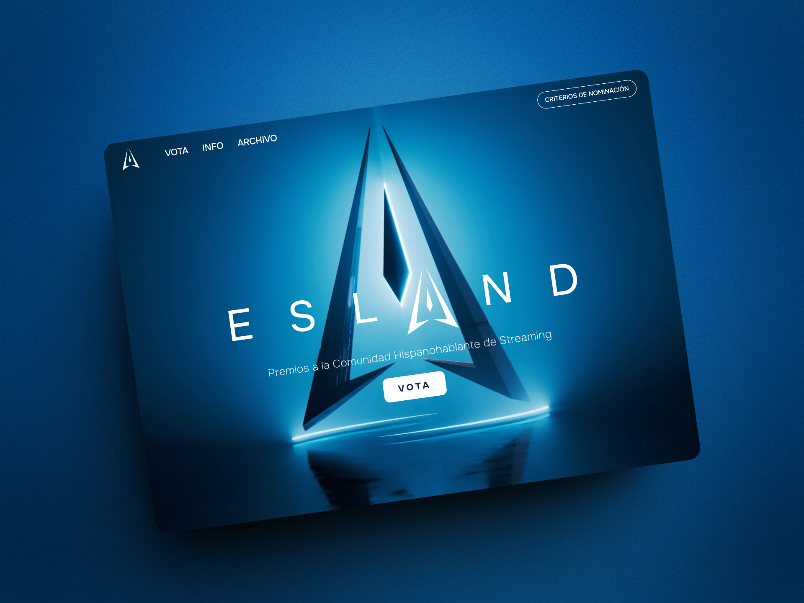

  <h1>Premios ESLAND (clone)</h1>

 

Welcome to Premios ESLAND (clone)! This project is a refined and enhanced clone of the official Premios ESLAND website, utilizing advanced technologies and features to improve the user experience. It aims to provide a seamless, engaging, and visually appealing platform for fans and participants of the ESLAND Awards.

## Features

1. **Enhanced User Interface:** Experience a modern and intuitive user interface that makes navigation effortless. The clone incorporates responsive design principles to ensure optimal performance across all devices.

2. **Improved Performance:** Leveraging the latest web technologies, this clone offers faster load times and smoother transitions, enhancing the overall user experience.

3. **Real-Time Updates:** Stay up-to-date with real-time notifications and updates about the ESLAND Awards. Whether it’s the latest news, live event coverage, or winner announcements, you'll always be in the loop.

4. **Interactive Elements:** Engage with interactive elements such as live polls, voting systems, and comment sections that foster a vibrant community around the awards.

## Background

The inspiration behind the Premios ESLAND (clone) project comes from the desire to elevate the user experience of the original ESLAND Awards website. By addressing existing limitations and incorporating user feedback, this clone seeks to deliver a superior digital experience that celebrates the essence of the ESLAND Awards.

In a landscape where digital interaction is paramount, the Premios ESLAND (clone) stands out by prioritizing user engagement and satisfaction. This project not only replicates the functionality of the original website but also introduces new features that add value and enhance usability. 

## Get Started

Explore the improved Premios ESLAND (clone) by visiting our website [here](https://premiosesland-clone.vercel.app/). Discover a seamless, engaging, and dynamic platform that celebrates the ESLAND Awards in style. Join us and experience the difference!
